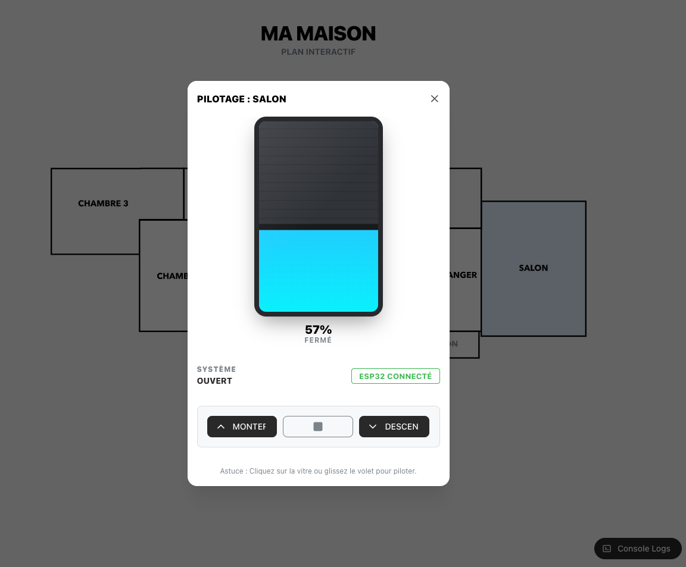

# 🏠 Système de Contrôle de Volets Roulants IoT


> Infrastructure résidentielle connectée, souveraine et temps réel.
> Projet personnel conçu, développé et déployé en production à domicile.

---

## 🎯 À propos

Ce projet déploie une stack complète pour piloter des volets roulants motorisés via une interface web moderne. Aucun cloud tiers — toute l'intelligence tourne sur un Raspberry Pi local, garantissant confidentialité et disponibilité même sans internet.

**Ce que j'ai construit :**
- Une interface React 18 + TypeScript avec tableau de bord temps réel
- Un firmware ESP32 (C++) avec protection moteur et persistance d'état
- Un broker MQTT local (Mosquitto) avec double tunnel TCP/WebSocket
- Un service de logging C++ pour l'archivage des événements

---

## 📸 Interface


---

## 🛠️ Stack technique

| Couche | Technologie |
|---|---|
| Interface | React 18, TypeScript, Mantine UI |
| Communication | MQTT (Mosquitto), WebSockets |
| Embarqué | C++, PlatformIO, ESP32 |
| Serveur | Raspberry Pi, Bash, Logger C++ |

---

## 🚀 Lancer le projet

### Prérequis
- Raspberry Pi avec Mosquitto installé
- Node.js 18+
- PlatformIO (VS Code)

### 1. Broker MQTT (Raspberry Pi)

```bash
sudo apt install mosquitto mosquitto-clients
```

Modifier `/etc/mosquitto/mosquitto.conf` :
```
listener 1883
allow_anonymous true
listener 9001
protocol websockets
allow_anonymous true
```

```bash
sudo systemctl restart mosquitto
```

### 2. Firmware ESP32

```bash
# Configurer include/secrets.h avec l'IP du Raspberry Pi
# Puis flasher via PlatformIO
pio run -t erase   # Vider la mémoire NVS avant le premier flash
pio run -t upload
```

Après le flash, connecte-toi au point d'accès Wi-Fi de l'ESP32 pour configurer le réseau local et le nom de la pièce (en minuscules : `salon`, `cuisine`…).

### 3. Interface React

```bash
cd React
npm install
npm run dev
```

Le badge de statut passe au vert quand l'ESP32 est en ligne.

### 4. Services de monitoring (Raspberry Pi)

```bash
cd /home/raspberrypi/services
g++ logger.cpp -o mqtt_logger -lpaho-mqttpp3 -lpaho-mqtt3as

nohup ./mqtt_logger > /dev/null 2>&1 &
nohup ./log_responder.sh > /dev/null 2>&1 &
```

---

## 🏗️ Architecture

```
┌─────────────┐     MQTT/TCP      ┌──────────────────┐     MQTT/WS
│   ESP32     │ ────────────────► │  Raspberry Pi    │ ◄──────────── React 18
│  (C++/PIO)  │                   │  Mosquitto 1883  │              TypeScript
│             │                   │  Logger C++      │              Mantine UI
└─────────────┘                   │  Log Responder   │
                                  └──────────────────┘
```

**Points techniques notables :**
- **Software Interlock** : algorithme ESP32 interdisant l'activation simultanée Montée/Descente
- **Non-blocking I/O** : gestion de la course via `millis()` pour réactivité constante
- **Persistance état** : `Preferences.h` mémorise position et nom de pièce après coupure
- **LWT (Last Will)** : notification automatique si un volet tombe hors ligne

---

## 🔍 Diagnostic

```bash
# Monitorer le trafic MQTT en temps réel
mosquitto_sub -h localhost -t "#" -v

# Réinitialiser l'historique des logs
> /home/raspberrypi/shutter_events.log
```

---

## 📖 Documentation technique

Pour une analyse approfondie des choix d'architecture, protocoles et patterns utilisés :
[Voir la documentation technique](documentation.md)

## 📜 Licence

MIT — Projet d'apprentissage et d'indépendance technologique.